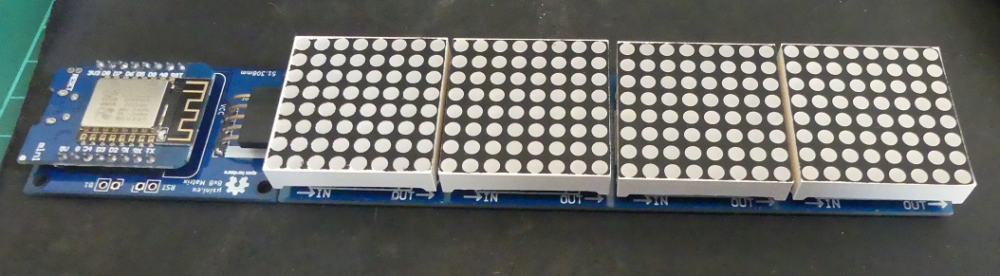
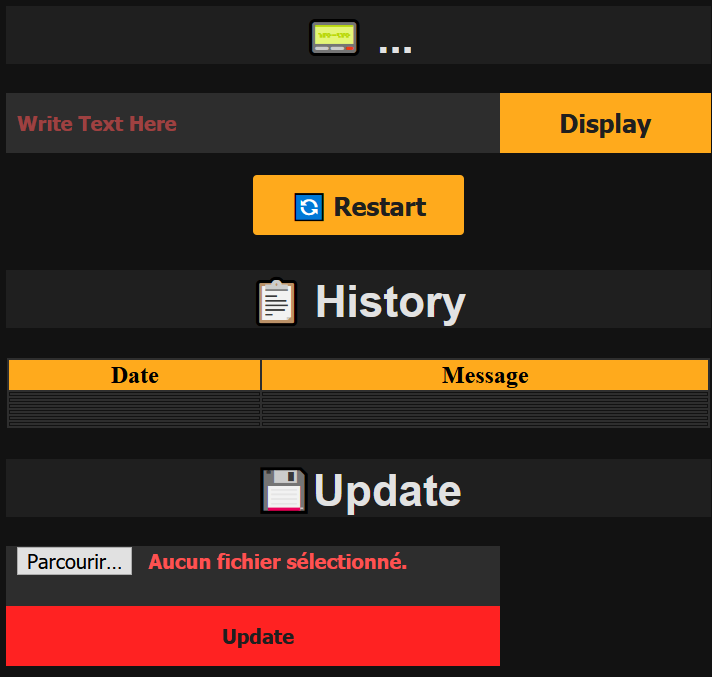
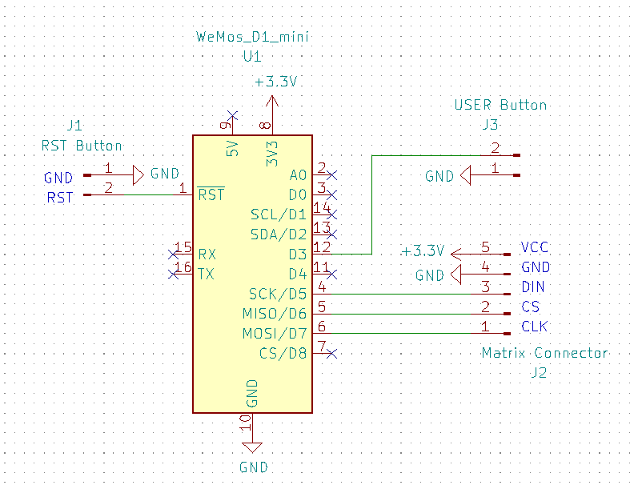

An 8x8 Matrix WiFi Display
--------------------------

# Features
* Responsive Web Interface
* Simple Web Request to send Message (ex: http://espmessenger/message/hello send hello)
* Accentuated characters supports
* Localization Support (French / English as for now)
* WiFiManager configuration (Nb of devices / Password and Username)
* Basic HTTP Authentication
* Discoverable using Netbios / Bonjour / SSDP
* Web Update

# Libraries used
* MD_MAX72xx
* MD_Parola
* ArduinoJSON (v6)
* WiFiManager

